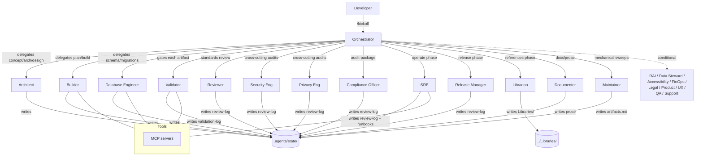

# System Design — Multi-Agent System

> **Source of truth for the design.** Companion to the curated reference library at `../Libraries/` and the drop-in scaffold at `../Template/`. Version 2 (2026-05-25). Supersedes v1 (preserved as `SYSTEM-DESIGN.md.v1.bak`).

---

## 1. Goal

A reusable, drop-in multi-agent system for VS Code (and any agents.md-compatible host) that:

- Installs into any project with one folder copy.
- Uses only published, stable Copilot primitives (chat modes, prompts, instructions, MCP).
- Preserves continuity across sessions and survives context compaction by writing all state to files and validating integrity on every turn.
- Enforces phase gates with human checkpoints.
- Carries a Microsoft-first default for standards while staying usable for non-Microsoft projects.
- Covers the full software-development lifecycle from concept through ongoing maintenance, including roles needed to defend the project against governance / security / privacy / compliance / accessibility / cost audits.
- Treats artifact format and viability as enforced gates — agents cannot ship a `.docx` where the manifest declares `.py`.
- Supports rescuing existing misformed projects via a documented migration workflow.

---

## 2. Roles

### 2.1 Baseline roles (14, always instantiated)

| Role | Chat mode file | Primary responsibility |
|---|---|---|
| **Orchestrator** | `orchestrator.chatmode.md` | Owns the lifecycle plan; dispatches to specialists; never writes artifacts; runs phase gates. |
| **Architect** | `architect.chatmode.md` | Concept, architecture, design specs. Produces design artifacts; does not write production code. |
| **Builder** | `builder.chatmode.md` | Implementation planning and artifact production. Writes code, IaC, tests, pipelines. |
| **Validator** | `validator.chatmode.md` | Three-pass artifact viability gate: format pass, static pass, build/test pass. Refuses non-viable artifacts. |
| **Database Engineer** | `database-engineer.chatmode.md` | Schema design, migrations, indexes, integrity constraints, RLS, DB performance, backup/restore. |
| **Reviewer** | `reviewer.chatmode.md` | General standards / style / lint / consistency review across all artifacts. Read-only on source. |
| **Security Engineer** | `security-engineer.chatmode.md` | Threat models, SBOM, CVE posture, secret scans, IR runbook seeds, pen-test prep. |
| **Privacy Engineer** | `privacy-engineer.chatmode.md` | DPIA, data-flow diagrams, retention policy, subject-rights workflow. |
| **Compliance Officer** | `compliance-officer.chatmode.md` | Control-to-framework matrix (SOC2 / ISO 27001 / HIPAA / FedRAMP / etc.); evidence-package assembly for audits. |
| **SRE / Operator** | `sre.chatmode.md` | Runbooks, SLOs/SLIs, observability config, deploy evidence, RTO/RPO testing. |
| **Release Manager** | `release-manager.chatmode.md` | Release notes, version policy, deprecation comms, CAB/ARB packages. |
| **Librarian** | `librarian.chatmode.md` | Writes and maintains `Libraries/**` entries; owns schema; runs volatility renewal cadence. |
| **Documenter** | `documenter.chatmode.md` | User docs, READMEs, Setup, prose artifacts, style-guide conformance. |
| **Maintainer** | `maintainer.chatmode.md` | Mechanical behavior-preserving changes: encoding sweeps, dep bumps, schema migrations, link-rot fixes. |

### 2.2 Conditional roles (9, activated by Project Profile)

| Role | Activated when... | Primary responsibility |
|---|---|---|
| **RAI Engineer** | Project has AI/ML features | Model cards, eval suite, red-team artifacts, bias tests, drift monitoring spec. |
| **Data Steward** | Project owns data products or trains models | Schema ownership, classification, lineage, retention, data-quality rules. |
| **Accessibility Engineer** | Project has UI | WCAG conformance evidence, screen-reader tests, color-contrast, ARIA. |
| **FinOps Engineer** | Cloud spend exceeds project threshold | Tagging discipline, budget alerts, rightsizing analysis, anomaly investigation. |
| **Legal / IP** | External distribution or non-permissive 3p deps | License-compliance scans, export-control review, contract-obligation tracking. |
| **Product / PM** | Product (not internal tool) | KPIs, roadmap, prioritization, customer-feedback synthesis. |
| **UX Researcher** | User-facing UI with research budget | Research plans, study artifacts, persona validation. |
| **QA Engineer** | Non-trivial system needing test strategy beyond unit tests | Test strategy doc, exploratory + load + chaos test results. |
| **Support / SuccessOps** | External users | Triage SLA, bug intake, KB articles. |

### 2.3 Role activation rule

At the **Concept** phase, the Orchestrator produces a **Project Profile** (see §6). At the **Concept gate**, the Orchestrator produces a **Role Manifest** that lists which conditional roles are active for this project. The Manifest is locked at gate-pass. Activating a role later requires a re-gate.

Inactive conditional roles still exist as chat-mode files; they simply refuse any task with "Not active per Role Manifest" and route back to the Orchestrator.

---

## 3. Phase queue

```
References → Concept → Architecture → Design → Plan → Build → Operate → Release → Audit → Maintain
```

| Phase | Owner | Output | Gate |
|---|---|---|---|
| **References** (recurring) | Librarian | `Libraries/**` entries needed by downstream phases exist + are within volatility renewal window | Automated: all ids cited downstream resolve to entries |
| **Concept** | Architect | `docs/concept.md` + Project Profile | Human |
| **Architecture** | Architect | `docs/architecture.md` + alternatives + diagram | Human |
| **Design** | Architect + Database Engineer (if data) | `docs/design.md` + schema design + threat-model summary | Human |
| **Plan** | Builder + Architect | `docs/implementation-plan.md` + **Artifact Manifest** | Human |
| **Build** | Builder, gated by Validator + Reviewer per artifact | Source / IaC / tests / pipelines / migrations | Automated per artifact |
| **Operate** | SRE | Runbooks, SLOs, observability, deploy evidence | Human (production-readiness review) |
| **Release** | Release Manager | Release notes, version, deprecation timeline, customer comms | Human |
| **Audit** | Compliance + Security + Privacy (+ conditional roles) | Evidence packages per framework | Human (sign-off) |
| **Maintain** (perpetual sibling) | Maintainer + any role | Logged maintenance actions; supersedes existing artifacts where needed | Automated per action |

### Phase-gate semantics

- A phase **cannot** start until the previous gate passes.
- **References** is recurring: any agent that detects a missing cited id immediately routes back into References before continuing.
- **Maintain** is a perpetual sibling: any agent can branch into it for behavior-preserving work; logged with `status: maintenance` in `artifacts.md`. Maintain never advances the main phase pointer.
- The Orchestrator refuses to advance the phase pointer in `plan.md` until the gate is satisfied.

---

## 4. State model

All shared state lives under `.agents/state/`. Each file has a fixed schema. Files added or expanded in v2 are marked **NEW**.

| File | Owner (writer) | Readers | Purpose |
|---|---|---|---|
| `checkpoint.md` | Every state-writing agent | All (read first) | Integrity header. `last_agent`, `last_action`, `expected_next_agent`, `expected_next_action`, `turn_token`, `last_updated`. |
| `plan.md` | Orchestrator | All | Current phase, phase queue, gate status. |
| `project-profile.md` | **NEW**. Orchestrator (at Concept gate) | All | Locked answers to profile questions; drives Role Manifest. |
| `role-manifest.md` | **NEW**. Orchestrator (at Concept gate) | All | Which conditional roles are active. |
| `artifact-manifest.md` | **NEW**. Architect + Builder (at Plan gate) | All | Per-artifact declaration: type, path, format, validation rule, owner. |
| `decisions.md` | Architect primary; any role may append | All | ADR-style, append-only. |
| `artifacts.md` | Builder | All | Index of artifacts produced; status; references manifest entry. Append-only. |
| `validation-log.md` | **NEW**. Validator | All | Per-artifact three-pass results; append-only. |
| `review-log.md` | Reviewer + Security + Privacy + Compliance + Accessibility + RAI (each writes prefixed entries) | All | All review findings; append-only. |
| `handoff.md` | Whichever agent is finishing a phase or task | Next agent | Single payload; overwritten. |

### Hard rules

1. Read `checkpoint.md` **first** every turn. If integrity check fails, refuse and run `/recover`.
2. Read all other relevant files at turn start; write back at turn end.
3. Append-only files: `decisions.md`, `artifacts.md`, `validation-log.md`, `review-log.md`. Supersede with new entries; never edit existing ones.
4. Overwritten files: `handoff.md`, `checkpoint.md`. `project-profile.md`, `role-manifest.md`, `artifact-manifest.md` are rewritten only on explicit re-gate events.
5. No state lives in chat context. If it matters, it goes here.

---

## 5. Compaction-recovery model

Conversational hosts compact context when it grows large. Compaction is normal but creates a known failure mode: agents proceed on summarized state without realizing detail was dropped.

Mitigation (see `../Libraries/core/compaction-and-recovery.md` for the full spec):

1. **`checkpoint.md` integrity header** rewritten on every state-writing turn with `turn_token` monotonically incremented.
2. **Mandatory pre-flight** at the top of every chat mode: read `checkpoint.md` first; refuse if `expected_next_agent` ≠ current mode, if `turn_token` is missing or non-monotonic, or if phase drift is detected.
3. **`/recover` prompt** rebuilds context from state files alone, classifying the breach, rewriting `checkpoint.md`, and routing to the correct agent.
4. **`/health-check` prompt** runs a non-destructive six-check scan on demand.

This makes the system survive multi-compaction sessions without silent drift.

---

## 6. Project Profile

Produced at the Concept phase. Locked at Concept gate. Drives the Role Manifest.

```yaml
project_profile:
  type: product | internal-tool | library | research | platform
  audience: internal-only | enterprise-customers | consumer | open-source
  ai_features: none | uses-llms | trains-models | inference-only
  data_products: none | reads | produces | trains-on
  ui: none | internal-only | external
  distribution: internal | ms-oss | external-commercial | mixed
  regulated_data: none | pii | phi | pci | financial | classified | multiple
  cloud_spend_tier: none | low | medium | high
  external_users: yes | no
  multi_team: yes | no
  release_cadence: continuous | weekly | monthly | quarterly | adhoc
  ms_stack: none | optional | preferred | required
```

The Orchestrator interviews the user during `/kickoff` to fill this in. Each field has an explicit fallback if unknown.

---

## 7. Role Manifest

Produced at the Concept gate, derived from Project Profile + reasonable defaults. Locked.

```yaml
role_manifest:
  baseline:
    - orchestrator
    - architect
    - builder
    - validator
    - database-engineer
    - reviewer
    - security-engineer
    - privacy-engineer
    - compliance-officer
    - sre
    - release-manager
    - librarian
    - documenter
    - maintainer
  conditional_active:
    - rai            # if project_profile.ai_features != none
    - data-steward   # if project_profile.data_products != none
    - accessibility  # if project_profile.ui != none
    - finops         # if project_profile.cloud_spend_tier in [medium, high]
    - legal          # if project_profile.distribution in [ms-oss, external-commercial, mixed]
    - product        # if project_profile.type == product
    - ux-researcher  # if project_profile.ui == external
    - qa             # if project_profile.type in [product, platform] OR multi_team
    - support        # if project_profile.external_users
  conditional_inactive: [...]
  locked_at: <UTC ISO 8601>
  locked_by: orchestrator
```

Inactive conditional roles refuse work and route to Orchestrator with a "not active" message. Re-activation requires explicit re-gate.

---

## 8. Artifact Manifest pattern

Produced at the Plan phase. The single most important addition in v2 — it prevents the Copilot-365 failure mode where models produce `.docx` content describing a platform instead of `.py` / `.sql` / etc. artifacts of the platform.

For every planned artifact:

```yaml
- id: A-042
  purpose: "Login flow handler with OAuth code exchange."
  path: src/auth/login.py
  type: source-code        # one of: source-code | iac | schema | migration | test | config | doc | spec | data | binary
  language: python         # for source-code; null for non-code types
  expected_format:
    extension: ".py"
    must_parse_as: python-3.11
    must_pass:
      - command: "ruff check src/auth/login.py"
      - command: "mypy src/auth/login.py"
      - command: "pytest tests/auth/test_login.py"
  must_NOT_be: [".docx", ".pdf", "design document", "wireframe", "prose"]
  produced_by: builder
  validated_by: validator
  reviewed_by: [reviewer, security-engineer]
  on_format_violation: refuse-and-route-back
  on_validation_failure: refuse-and-route-back
  manifest_locked: true
```

### Gates that consume the manifest

- **Plan gate**: every task in `implementation-plan.md` maps to ≥1 manifest entry; no manifest entry has `type: doc` for something the Concept declared as a feature.
- **Build artifact gate**: actual artifact path matches manifest path; extension matches; Validator's three-pass green.
- **Audit gate**: every manifest entry has a corresponding artifact on disk in the declared format and language; no `.docx` exists where the manifest says `.py`; no orphan artifacts exist that aren't in the manifest.

---

## 9. Validator three-pass gate

Validator's per-artifact responsibility, enforced before Reviewer can pass an artifact.

| Pass | What it checks | Tools |
|---|---|---|
| **Format pass** | File extension matches manifest; content parses as declared format; not a `must_NOT_be` type. | extension check + parser dry-run (e.g. `python -m py_compile`, `tsc --noEmit`, `bicep build --no-restore`) |
| **Static pass** | Lint clean; types check; format-check passes. | language-appropriate: ruff/mypy, eslint/tsc, clippy, dotnet format, PSScriptAnalyzer, golangci-lint, etc. |
| **Build/test pass** | Compiles or builds; tests covering this artifact pass. | language-appropriate: cargo test, dotnet test, pytest, jest, go test, etc. |

Validator writes one entry to `validation-log.md` per artifact per pass attempt:

```
## V-<NNN>: <artifact-id> validation
- Date: YYYY-MM-DD
- Artifact: <A-NNN>
- Format pass: <pass | fail: <reason>>
- Static pass: <pass | fail: <reason>>
- Build/test pass: <pass | fail: <reason>>
- Verdict: <pass | fail>
- turn_token: <int>
```

Reviewer cannot issue a `pass` verdict on an artifact without a matching Validator `pass` entry. Audit cannot pass without every artifact having a Validator `pass`.

---

## 10. Topology



---

## 11. Tooling layer (MCP)

Default MCP servers registered in `Template/.vscode/mcp.json`:

- **filesystem** — agent read/write of project files.
- **git** — branch, diff, commit operations.
- **github** (optional) — issues, PRs, Actions runs.

Add domain-specific MCP servers per project profile:

- **Azure MCP** if `ms_stack` in [preferred, required] and cloud target is Azure.
- **Postgres / MySQL / SQL MCP** if Database Engineer is active and the DB has an MCP server available.
- **Playwright / browser MCP** if Accessibility or QA roles need automated UI validation.

Read-only by default for: Reviewer, Security Engineer, Privacy Engineer, Compliance Officer, Accessibility, RAI Engineer, Legal/IP, UX Researcher. Writes go through Builder / DB Engineer / Documenter / Librarian / Maintainer / SRE / Release Manager / Validator.

---

## 12. Instruction layering

Loaded by every Copilot turn in this order (later overrides earlier):

1. `AGENTS.md` (root) — cross-tool baseline.
2. `.github/copilot-instructions.md` — repo-wide rules.
3. `.github/instructions/*.instructions.md` with matching `applyTo` glob.
4. The currently selected chat mode's `.chatmode.md` body.
5. Any `.prompt.md` invoked during the turn.

Keep `copilot-instructions.md` short. Per-agent expertise lives in the chat-mode body. Per-language style rules live in `instructions/*.instructions.md` with the right glob.

---

## 13. Reference-library binding

Every chat mode cites `Libraries/` entries by `id` only, never by URL. The `decisions.md` and `review-log.md` schemas include a `references` field that must cite at least one library id for any non-trivial decision or finding.

When an agent needs a citation that has no matching `Libraries/` entry: route to **References phase** (Librarian) before continuing. This is enforced by the gate, not by chat-mode prose.

---

## 14. Existing-Project Migration workflow

For applying this system to a project that was conceived in a different surface (Copilot 365, ChatGPT, Edge Copilot, etc.) and may contain misformed artifacts (e.g., `.docx` files where source code is needed):

### Phases

1. **Inventory** (Maintainer) — scan all existing artifacts; classify by extension + content sniff; produce `migration/inventory.md`.
2. **Reconcile** (Architect + Validator + Database Engineer if relevant) — derive a target Artifact Manifest from the existing design docs (even if those design docs are themselves in misformed format); flag every existing artifact as **keep** / **convert** / **replace** / **discard**; produce `migration/reconciliation.md`.
3. **Plan** (Builder) — produce a migration `implementation-plan.md` with one task per convert/replace artifact.
4. **Execute** (Builder + Database Engineer + Documenter, gated by Validator) — produce correct-format artifacts; Validator three-pass gates each before logging in `artifacts.md`.
5. **Retire** (Maintainer) — move superseded files into `archive/` for traceability; never delete (`status: archived` in `artifacts.md`).
6. **Audit** (Compliance + Security + Privacy + conditional roles) — produce evidence packages confirming the migrated project meets the same gates as a greenfield one.

### Tooling

- **`/migrate-existing` prompt** under `.github/prompts/` orchestrates Phases 1–2 and produces the migration plan; user reviews; then normal Build phase takes over for execution.
- The Project Profile interview during `/kickoff` includes a flag `migrating_from: <surface or "none">`. If set, kickoff routes through `/migrate-existing` before standard phases.

---

## 15. Host-environment requirement

This system requires a chat host that supports **real file-write tools** scoped to the project workspace. Supported hosts include:

- VS Code with GitHub Copilot Chat (the canonical target).
- Any agents.md-compatible host with `editFiles` / `applyPatch` / equivalent tool surface.

Unsupported hosts (will surface text but cannot persist artifacts to a project repo):

- Copilot 365 in web browser.
- ChatGPT / Claude / Gemini in web browser without project-write tooling.
- Edge Copilot / mobile chat surfaces.

If the host cannot write project files, the agents will appear to function but no real artifacts get produced — exactly the failure mode that motivated v2's Artifact Manifest + Validator gates. Setup/SETUP.md enforces this check at install time.

---

## 16. Continuity strategy (recap)

Continuity is achieved by:

1. **Compaction-safe state**: everything important under `.agents/state/` with append-only logs and the `checkpoint.md` integrity header (§5).
2. **Pre-flight gate**: every chat mode reads `checkpoint.md` first and refuses on integrity failure.
3. **Append-only logs**: decisions, artifacts, validations, reviews — never edited, never summarized away.
4. **`/recover` and `/health-check`** prompts for explicit recovery and drift detection.

This gets you near-perfect continuity in practice. Long sessions, multi-day handoffs, and re-engagement of the project months later all work the same way: any agent's first move is to read state.

---

## 17. Non-goals

- Not an autonomous end-to-end execution system. Human gates are required at every phase boundary and at Audit sign-off.
- Does not ship its own memory store. State is plain markdown on disk.
- Does not target non-VS-Code surfaces in the canonical Template; agents.md compatibility is a side-effect, not a primary surface.
- Does not replace human accountability for any audit verdict. The Compliance / Security / Privacy roles **assemble** evidence packages and **flag** gaps; humans sign off.

---

## 18. Decision log entries (recorded at v2 finalization, 2026-05-25)

These are the design decisions captured for traceability. They live in `Design/SYSTEM-DESIGN.md` (this file) rather than the project-instance `decisions.md` because they are decisions about the system itself, not about a project using the system.

### D-001: Adopt 14-baseline + 9-conditional role model
- Context: Original 4-mode design (Orchestrator/Architect/Builder/Reviewer) failed in self-application during initial bootstrap; ~40% of work had no proper role home.
- Decision: Expand to 14 baseline + 9 conditional roles; conditional roles instantiated by Project Profile.
- Alternatives considered: keep 4-mode and stretch role scopes; full Report 01 §6 tier model with sub-agent fan-out.
- References: this document §2.
- Consequences: more chat-mode files to maintain; clearer audit-defense path; conditional roles add zero overhead when inactive.

### D-002: Promote Database Engineer to baseline
- Context: >90% of projects have persistent state; deferring DB work to Builder leads to under-specified schemas and missed migration risk.
- Decision: Database Engineer is baseline, not conditional.
- References: §2.1, §10.
- Consequences: schema design + migration safety + RLS get a clear owner from Concept onward.

### D-003: Promote Validator to baseline
- Context: Original design had no enforced gate that artifacts actually compile / lint / type-check / build. Reviewer is read-only and cites standards by id, but does not run toolchains.
- Decision: Validator is a baseline role enforcing a three-pass gate per artifact (§9). Reviewer cannot pass an artifact without a matching Validator pass.
- References: §9.
- Consequences: every artifact has machine-verifiable viability proof; supports "show me proof every artifact compiles" audit asks.

### D-004: Introduce Artifact Manifest pattern
- Context: Models in conversational hosts (Copilot 365, ChatGPT, Edge Copilot) frequently produce content **about** a project (Word docs, prose) instead of artifacts **of** the project (`.py`, `.sql`, etc.). 500+ misformed-artifact platform observed in the wild.
- Decision: At Plan phase, produce `artifact-manifest.md` declaring per-artifact type, path, format, validation rule. Gates enforce manifest conformance at Plan, Build, and Audit.
- References: §8.
- Consequences: agents cannot drift into wrong-format outputs; refusal is automatic; salvages the Copilot-365 failure mode.

### D-005: Introduce Project Profile + Role Manifest
- Context: Conditional roles need explicit activation; activation rule must be transparent and re-gateable.
- Decision: Concept phase produces Project Profile (§6); Concept gate produces Role Manifest (§7) locking conditional-role activation; activation changes require re-gate.
- References: §6, §7.
- Consequences: inactive roles are visible-but-quiet; project shape is captured in one place; audit trail of role decisions exists.

### D-006: Phase queue expanded to 10 phases (References + Operate + Release + Maintain)
- Context: Original 6-phase queue (Concept → … → Audit) had no home for reference curation, post-deploy operations, release management, or ongoing maintenance.
- Decision: Add References (recurring), Operate, Release, Maintain (perpetual sibling). See §3.
- References: §3.
- Consequences: every kind of work has a phase home; phase transitions are explicit; Maintain doesn't block forward progress.

### D-007: Adopt compaction-recovery integrity model (carried from v1.1)
- Context: Context compaction observed silently degrading agent state during system bootstrap itself.
- Decision: `checkpoint.md` integrity header rewritten every state-writing turn; mandatory pre-flight in every chat mode; `/recover` and `/health-check` prompts. See `Libraries/core/compaction-and-recovery.md`.
- References: §5.
- Consequences: system survives multi-compaction sessions; integrity is machine-checkable.

### D-008: Document Existing-Project Migration as a first-class workflow
- Context: User's prior platform (built in Copilot 365 Auto-model) contains 500+ misformed artifacts (`.docx` where source code should be); system must be able to rescue such projects, not only greenfield ones.
- Decision: Add §14 Migration workflow + `/migrate-existing` prompt + `migrating_from` profile flag.
- References: §14.
- Consequences: the system can be applied to existing projects without forcing greenfield restart; migration is bounded by Validator gates so misformed artifacts cannot leak forward.

### D-009: Host-environment requirement is explicit
- Context: Same Copilot-365 anecdote — host without file-write tooling cannot produce real artifacts even if it appears to "respond".
- Decision: Setup/SETUP.md asserts supported-host list (§15); install-time check refuses to proceed on unsupported hosts.
- References: §15.
- Consequences: prevents users from believing they have a working install when the host cannot persist artifacts.

---

## 19. What this system is not (recap)

Not a runtime framework. Not a product. Not Microsoft-exclusive. Not a substitute for human sign-off on audit verdicts. Not an autonomous agent. It is a **standard + scaffold** for using VS Code Copilot Chat (and compatible hosts) to manage a software project across its full lifecycle with file-based continuity and enforced gates.
